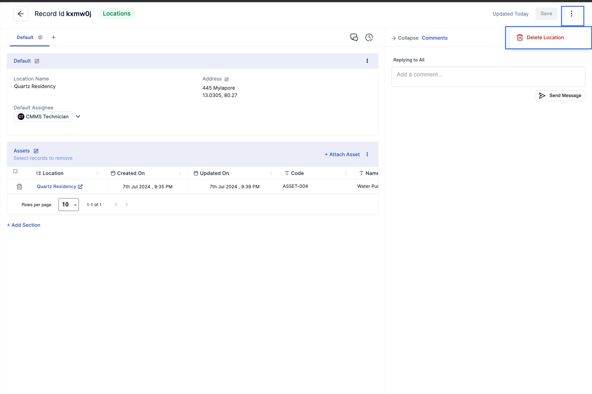
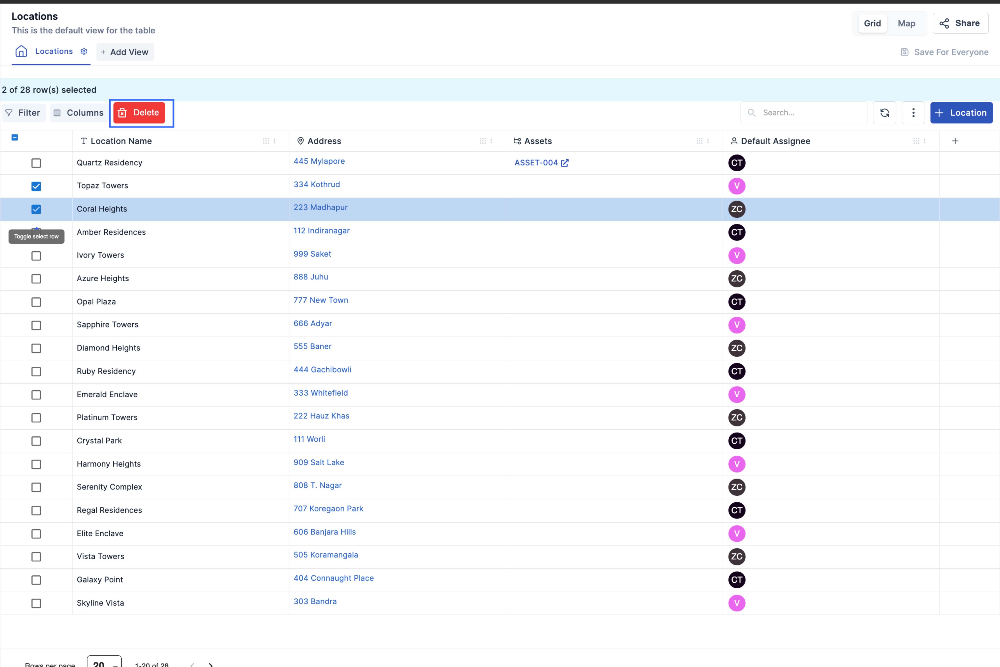

In Zorp, a location is an entity that represents a physical place where your company operates. Here are some important concepts about locations.

## Default Assignee

Every location has a default assignee. The default assignee is the person who is responsible for the location. When a new work order is created for a location, the default assignee is automatically assigned to the work order. The default assignee can be changed when creating or editing a location.
For details, see [Create a Location](https://docs.zorp.one/cmms/Locations)

# Locations and Other Zorp Entities

This section explains how Locations connect to other Zorp entities.

## Assets
An asset is a piece of equipment in an organization. Locations are associated with assets. A location can have more than one asset linked to it. For example, if you set up a location for a warehouse, you might associate all the forklifts in the warehouse with that location.

For more information on assets, see [About Assets](https://docs.zorp.one/cmms/assets)

## Work Orders
A work order is a document that details and records progress on a maintenance task. You can create work orders for maintenance at a location. For example, for plumbing repairs needed at a warehouse.

For more information, see [Create a Work order](https://docs.zorp.one/cmms/WorkOrders#how-to-create-a-work-order)

# Create a Location
This article explains how to create a location and describes location form fields.

## Create a Location
1. From the sidebar, select Locations.

2. Click on + Location.
(/images/create location.png)

3. Enter a Location name, Address and any other details. You can also add a default assignee and Assets to the location.
4. Click on Create.

## Create Bulk Locations
1. Select Import option from Menu icon to the left of + Location button.
(/images/bulk import 1.jpeg)

2. Upload a CSV or XLS file with the location details.

## Location Form Fields

1. Location Name: The name of the location. (Max. 255 characters) Note: A location name is required.

2. Address: This is the address of the location. It can include street name, city, and optionally Latitude/Longitude. Note: An address is required.

3. Default Assignee (Optional): This is the default user assigned to work orders at this location. (Must be an existing Zorp user)

4. Assets: List of assets associated with this location. 

# Edit a Location
This article explains how to edit a location.

## Edit a Location
1. Click on the location you want to edit. You will be redirected to Location details page.
2. Click on the field you want to edit.
3. Click on Save.

# View and Filter Locations
This article explains how to use different views in the Locations module, and how to use filters to control which locations you see.

The MaintainX web app has the following location views:

1. Grid View: lists locations in a table.

2. Map View: shows locations on a map.

You can switch views using the view selector in the top right corner of the Locations module.

## Filter Locations
You can filter locations by using the filter options available in the Locations table.

# Delete a Location

This article explains how to delete a location and bulk delete locations.

## Delete a Location
1. From the sidebar, select Locations.
2. Click on the location you want to delete. You will be redirected to Location details page.
3. Select Delete Location from Menu.

## Bulk Delete Locations
1. Select all the Locations you want to delete.
2. Click on Delete button.

# Customize locations
This article explains how to customize locations.

## Customize Locations
1. Click on the Add + button.

2. Enter the name of the field you want to add.
3. Select the field type.
4. Click on Create.

