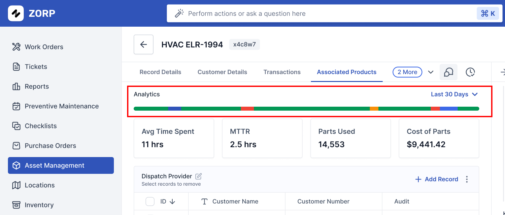
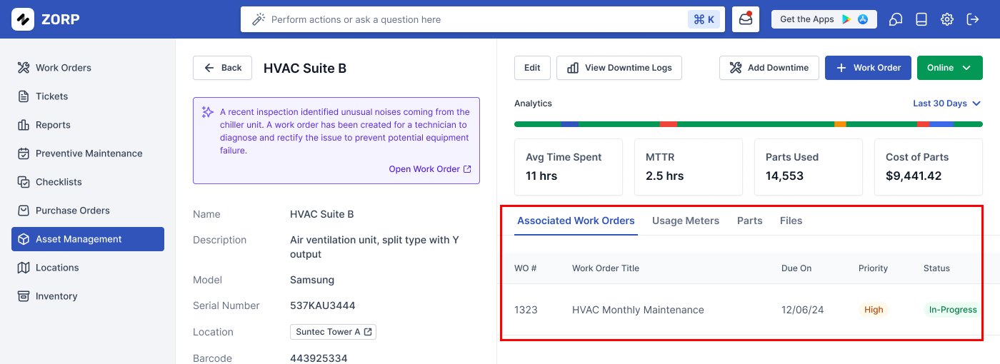
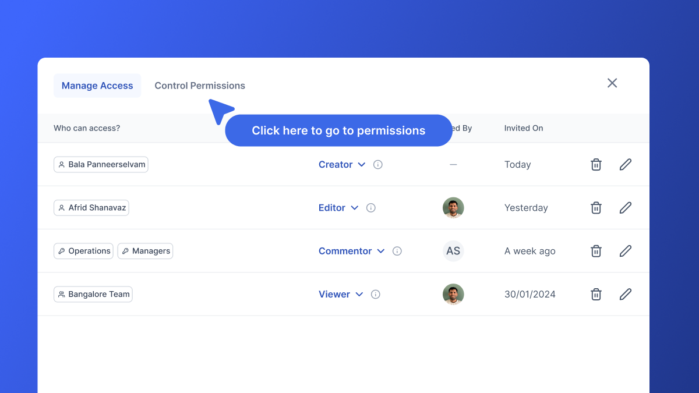
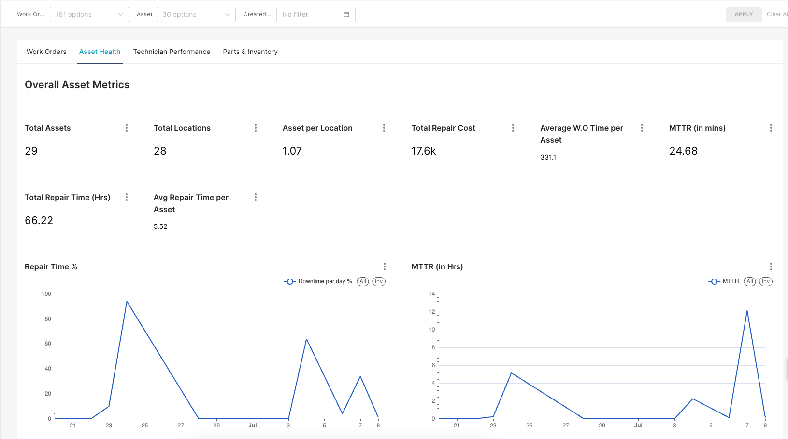

In ZORP, an asset is an entity that represents a piece of equipment in an organization. For example, in an office facility, the Air conditioner could be an asset. Also is the water dispenser.

## Important Concepts
Here are some important concepts and properties of assets. For details about those different properties, see Asset Form Fields.

## Asset Types
Assets can have types. Asset types can be used to categorize the assets. ZORP provides some default asset types here. But you can also add your custom asset types.

- For more information about asset types, see [Create an Asset](https://docs.zorp.one/cmms/create_assets#creating-an-asset).
- For more information about reporting on assets, see:
  - Asset Health Reports.
  - Work Order Reports.
  - View and Export Asset Data.

## Criticality
Criticality is a measure of how important an asset is to your company. It’s a field in the asset form that specifies whether the asset is Critical, Important or Normal for your organization. Criticality can be used for filtering and reporting.

For more information, see View and Filter Assets and View and Export Asset data.

## Asset Status
An asset’s status represents the state of the asset. An asset in ZORP can have the following statuses:

Operational: the asset is working as expected
Not Operational: the asset is not operational, usually for planned or unplanned maintenance.
Do Not Track: do not track the asset's uptime/downtime.

## Asset Depreciation
ZORP automatically provides the current value of the assets post depreciation using your chosen depreciation methods.

## Asset Uptime
You can see in one central view the Asset's uptime performance and the workorders performed over the last 10 days. This in one concise view highlights the assets that need your attention vs that don't.

  

## Assets and Workorders
A work order is a document that details and records progress on a maintenance task for an asset. For more information on the relationship between an asset and a work order, see Create a Work Order.

  

An asset’s work order history is a good way to see the work that's planned for your assets by your team. For more information, see View and Export Asset Data.

## Parts and Inventory
An asset can be linked to multiple parts. Parts are consumable pieces used by assets, or items used for maintenance on an asset. For example, in a car wash, an industrial light can be an asset. A part linked to this asset is a fluorescent bulb.

## Locations
An asset can be associated with a location. In MaintainX, a location represents a physical place where your company operates. For example, a location could be a site, or one building in a compound.

## Teams
An asset can be assigned to multiple teams. These teams are responsible for the maintenance work for that asset.

## Customizing Assets
You can create asset types or have customized fields for your assets. For more information, see Customize Assets. 

## Access Controls
By default, Assets can be viewed, added, modified and removed by the admin. You can customize these options via Access controls. 
Access controls are possible at 
1. The Asset Level
2. The View level
3. The Column level

  

## Reporting
All asset details are provided under [Reports -> Asset Health](https://cmms.zorp.one/#/bireports/Reports).
Comprehensive reports cover your lifecycle of the assets, operating time, downtime, most expensive assets and more.

  

