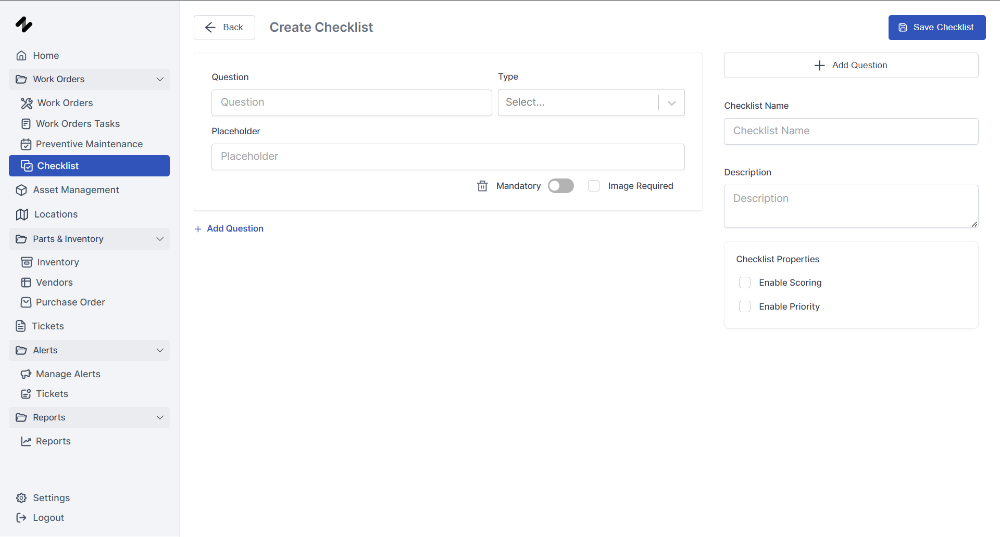

## What are Checklists?

Checklists are essentially a blueprint  used to ensure technicians follow standardized procedures during maintenance tasks. They outline a specific set of questions or steps that need to be completed, promoting consistency and quality in maintenance work.  ERPLite CMMS integrates a powerful checklist builder to create customized checklists for various needs.

## The Checklist Builder

The checklist builder empowers you to design comprehensive checklists tailored to specific equipment types, procedures, or tasks.  This functionality streamlines maintenance processes by:

Improving Consistency: Checklists ensure technicians follow the same steps every time, reducing the risk of missed procedures or errors.

Enhancing Data Collection: Capture valuable data through various question types, providing insights into the condition of your assets.

Promoting Collaboration: Share standardized checklists across your team, fostering knowledge transfer and best practices.
Creating a Checklist

1. Navigate to the "Checklists" section.
2. Click "Create New Checklist."
3. Provide a descriptive name for your checklist.
4. Start building your checklist by adding questions.
5. Field Types: Choose the most appropriate field type for each question from the following options:
- Text: Allows technicians to enter free-form text responses.

- Number:  For capturing numerical data (e.g., measurements, readings).

- Single Select: Presents a list of options for technicians to choose one answer.

- Multi Select: Allows technicians to select multiple options from a list.

- File: Enables technicians to upload relevant files (e.g., photos, reports).

- Signature:  Captures technician signatures for electronic sign-off.

- Date/Time: Records the date and time when a step is completed.

- Boolean:  For Yes/No questions.

(Optional) Enable Scoring: Assign point values to each question. This allows you to calculate a total score for the completed checklist, providing a basic assessment of the task execution.

(Optional) Set Question Priority: Prioritize specific questions to ensure technicians address critical steps first.
Click "Save Checklist" to create your checklist.
Attaching Checklists to Work Orders

Once you've created a checklist, you can easily attach it to relevant work orders.  This ensures technicians have the necessary instructions readily available while performing maintenance tasks.
