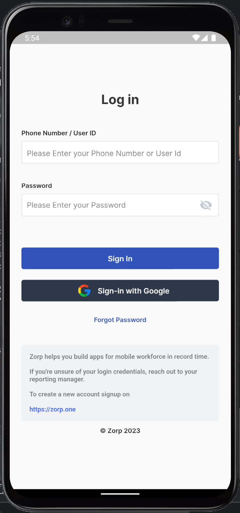

## Download the App

To get started with the app, download it from the respective app store:

- [Download from Google Play Store](https://play.google.com/store/apps/details?id=one.zorp&hl=en_US)
- [Download from Apple App Store](https://apps.apple.com/us/app/zorp-user/id1581396842)

## Login to the App

1. **Open the App**: Locate the app on your device and tap to open it.

2. **Login Screen**: On the login screen, enter your user ID, phone number, or email address that you have received.

3. **Enter Password**: Enter the password associated with your account.

4. **Submit**: Tap the login button to access the app.

You're now logged in and ready to use the app!

