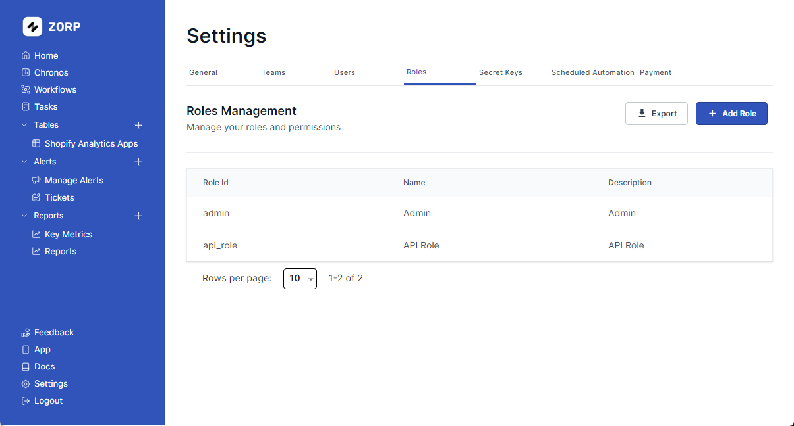

# Managing Roles

Roles are a way to manage permissions for your users. You can create roles and assign them to users. Each role can have a set of permissions that define what the user can do in the app.

## Creating a Role

To create a new role, click on the `Add Role` button. You will be asked to enter the name of the role and a description. Once you have entered the details, click on the `Create` button to create the role.

### Role Permissions

1. Task Permissions - Allows the user to create, edit, delete, and view tasks.
2. User Permissions - Allows the user to create, edit, delete, and view users.
3. Role Permissions - Allows the user to create, edit, delete, and view roles.
4. Team Permissions - Allows the user to create, edit, delete, and view teams.
5. Alert Permissions - Allows the user to create, edit, delete, and view alerts.
6. Reports Permissions - Allows the user to view reports.
7. Workflow Permissions - Allows the user to create, edit, delete, and view workflows.
8. Account Settings Permissions - Allows the user to edit account settings.
9. CRON Permissions - Allows the user to create, edit, delete, and view CRON jobs.

