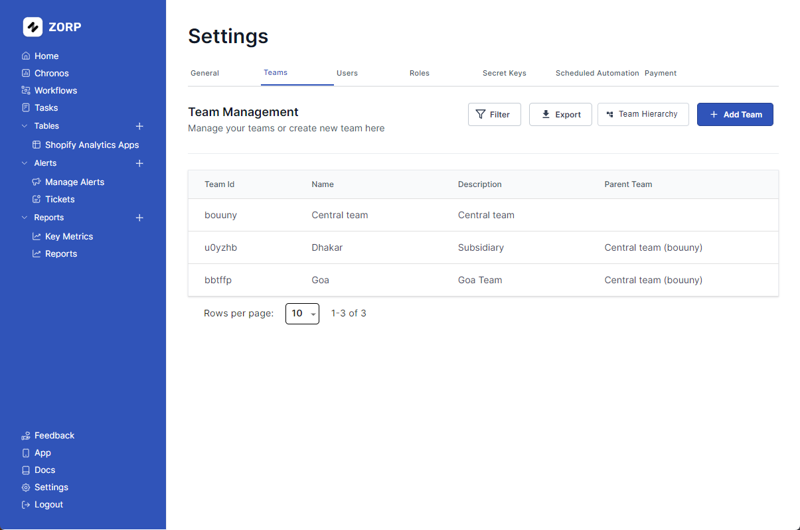

Managing teams is a critical part of any organization. Zorp let's you assign teams to your users and manage their access to the platform.

## Adding a New Team

Follow these steps to add a new team into the mix

1. Head over to the `settings` tab on the left sidebar.
2. Click on the `Teams` tab.
3. Click on `Add Team` .
4. Fill in all necessary details.
5. Hit `Create Team` .

You have successfully, added a new team.

## Deleting a Team

Follow these steps to delete an unwanted team from the hierarchy.

1. Click on the team you want to delete.
2. Click on `Delete` .

There you go!

## Cool Add Ons

Got 1000+ Teams? No worries! Apply `Filter` and save time. 
You can also `Export` your team hierarchy. Just saying.

