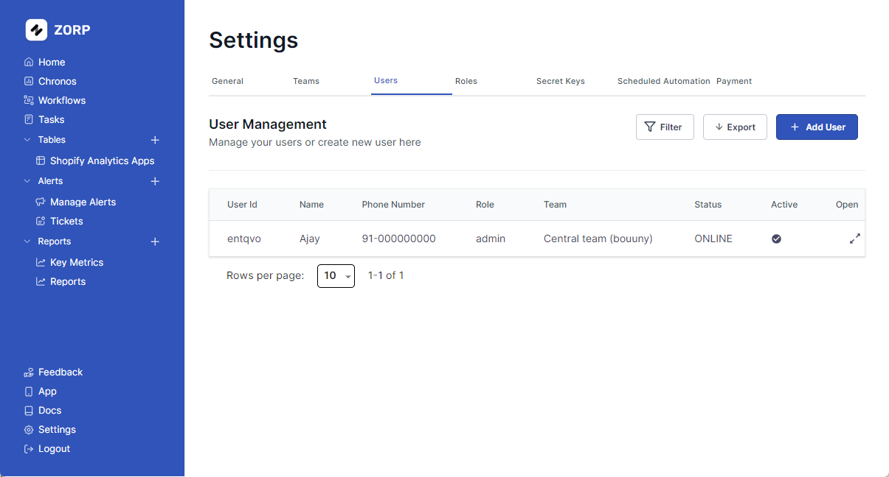

ERPLite provides a user management system that allows you to manage users and their relations to roles and teams within ERPLite. This system is used to authenticate users and authorize them to access the services provided by ERPLite.

## Adding a User
To add a new user, click on the `Settings` tab on the left sidebar

1. Click on the `Users` tab
2. Click on the `Add User` button.
3. Fill in the user details.
4. Click on the `Create User` button.

## Editing a User
To edit a user, head over to the `Settings` tab on the left sidebar

1. Click on the `Users` tab
2. Open on the user you want to edit
3. Click on the `Edit` button
4. Edit the user details
5. Click on the `Update User` button

## Deleting a User
To delete a user, click on the `settings` tab on the left sidebar

1. Click on the `Users` tab
2. Open on the user you want to delete
3. Click on the `Delete` button
4. Confirm the deletion

## Changing a Users Password
Firstly, head over to the `Settings` tab on the left sidebar. Then continue following these steps:

1. Click on the `Users` tab.
2. Open on the user whose password you want to edit.
3. Click on `Change Password` button.
4. Type & Re-type the new password.
5. Hit `Change Password` button.

## Cool Add Ons
Your team is 1000+? No worries! Apply `Filter` and save time.

You can also `Export` your user list. Just saying.
